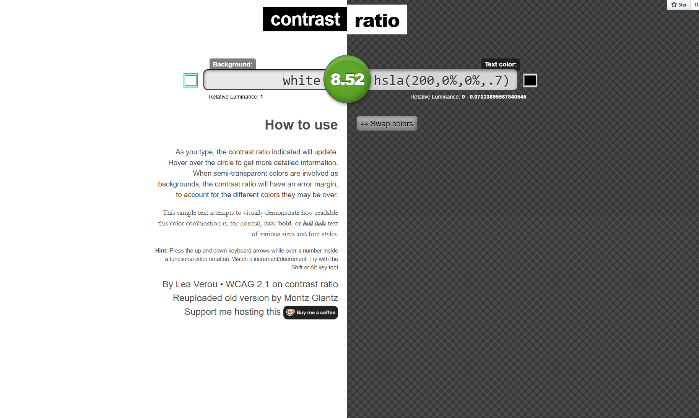
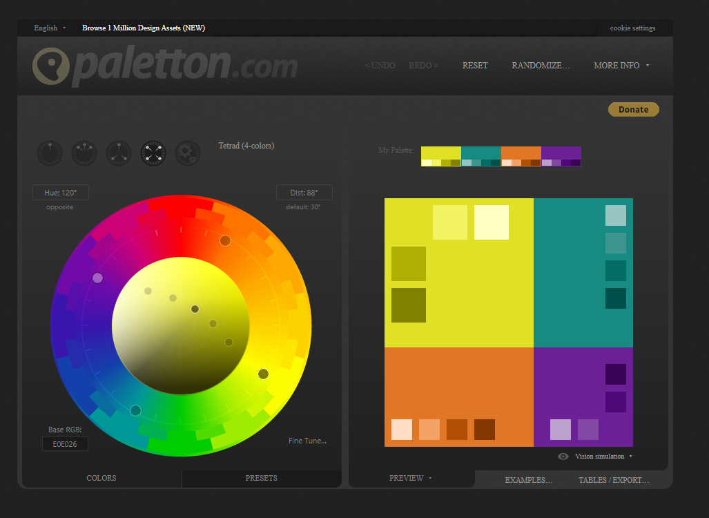
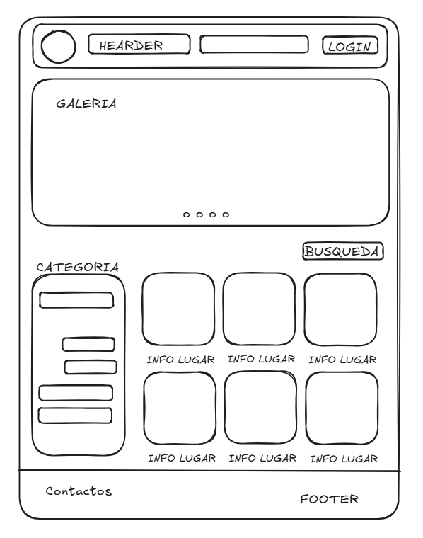
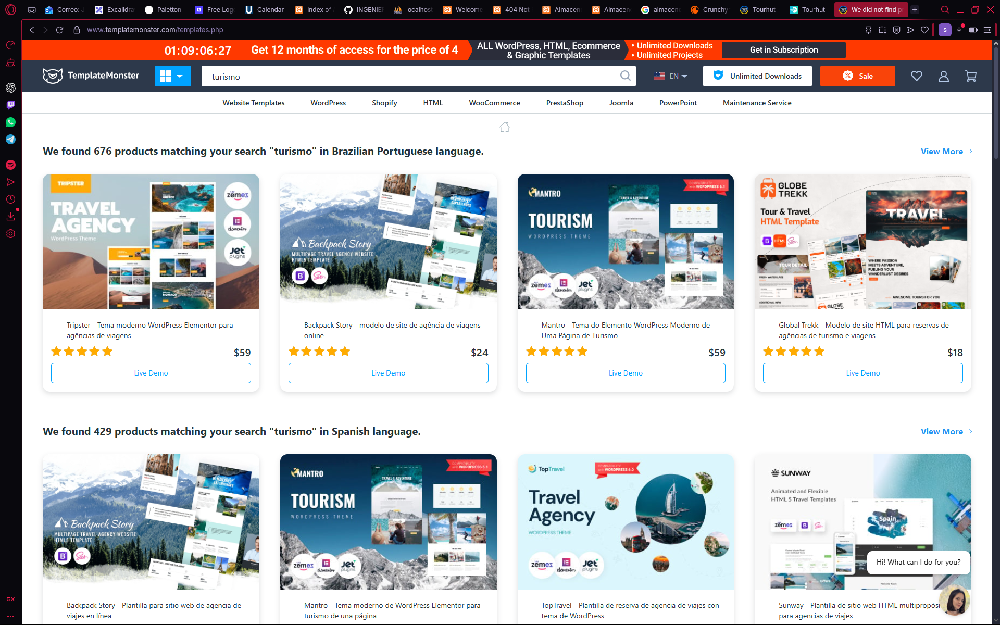
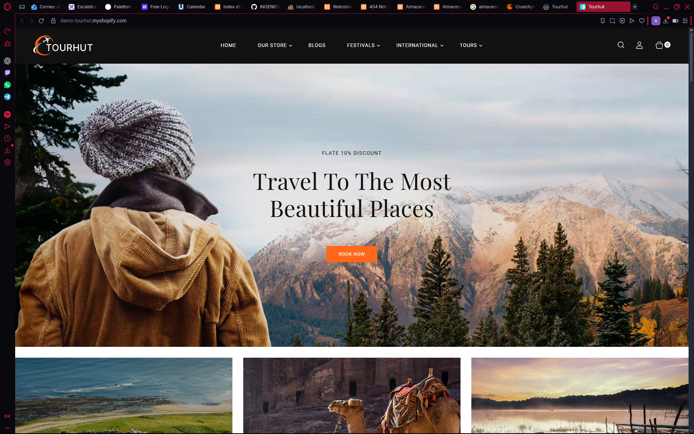
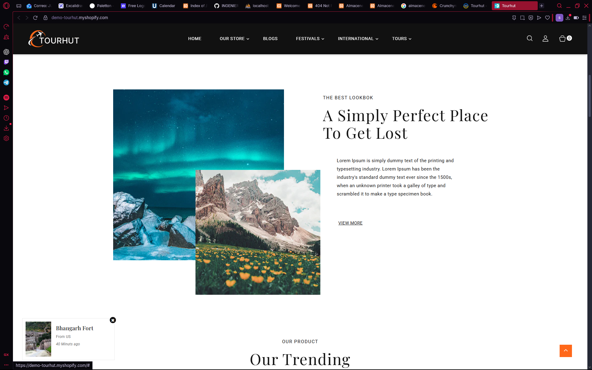

# Nuevas Herramientas

A lo largo de la clase conocimos dos nuevas herramientas "Contrast-Radio" y "Paletton" 

### Contrast-Radio

Una paguina web utilizada para observar el porcentaje que compatibilidad de contraste entre dos colores, util para seleccionar un color de fondo un color para las letras

### Paletton

Palletton, pagina web destinada para tener distintos colores que combinan, este hace referencia al uso de la teoria del color para la seleccion de los mismos

# WIREFRAMES

Dentro de clase realizamos distintos bocetos donde diseñamos como queremos que se viera nuestra paguina web

## Primer boceto

Dentro del primer wireframe usamos nuestra imaginacion de como se veria. Teniendo en cuenta ciertos requisitos que se nos presento en clase. La paguina web consiste en visita de los lugares turisticos y en las rutas gastronomicas que podemos encontrar dentro del ecuador

Este mismo contiene un logo, un header con una barra de navegacion, un inicio de sesion, Galeria de los lugares mas populares, un apartado de busqueda, uno de categorias, varias presentaciones de los lugares turisticos con su debida informacion y al final un footer con informacion de la empresa y contactos relevantes de información.

## Referencias

Como segundo punto, tomamos referencias de la paguina "[[TemplateMonster](https://www.templatemonster.com)]" una paguina que publica varios templates prediseñados donde podemos buscar el tipo de paguina web que estemos diseñando y tomar referencias para poder mejorar nuestro primer boceto.

Para realizar el boceto mejorado he tomado referencias del siguiente template "[[TourHut](https://demo.templatemonster.com/pt-br/demo/246497.html?_gl=1*1kjr2xt*_ga*MTQyNjE3NTIzNy4xNzYwNTQ1NDUy*_ga_FTPYEGT5LY*czE3NjA1NDU0NTEkbzEkZzEkdDE3NjA1NDU4MzAkajU3JGwwJGgw)]" una que tiene como tema el turismo y la presentación de varios lugares populares.

Tomando nota de los apartados que mas nos gustan podemos continuar con un boceto mejorado 

## Segundo boceto

Listos con el segundo boceto, eh añadido un apartado de 3 imagenes donde se relaten las regiones del Ecuador, un header mas sofisticado y completo, rellenado con informacion relevante que iremos a encontrar a lo largo de nuestro wireframe, un apartado para cambiar el idioma, haciendolo accesible para extranjeros. Continuamos con un apartado de rutas gastronomicas, las cuales podriamos seleccionar, a su vez tenemos un texto con una breve descripcion de lo que es, pasamos a un apartado de populares, dandonos un catalogo de imagenes en las cuales podemos presenciar su puntuación e informacion relevante del lugar, estos lugares son los mejores puntuados por la comunidad. Como ultimo apartado llamado explorar, el mismo ya ha sido diseñado como primera vista, lo agregado fue el apartado de region para poder escojer y observar los distintos lugares relacionados a diche region.

## Creacion de logos

Para la creacion de logos nos hemos ayudado de una inteligencia artificial llamado "[[TemplateMonster](https://looka.com)]" en la cual tendremos que poner el numbre de nuestra empresa o el nombre de nuestra marca y a su vez un logo corto que represente a nuestra empresa. Para este ejemplo eh tomado el nombre de "Sova" 

