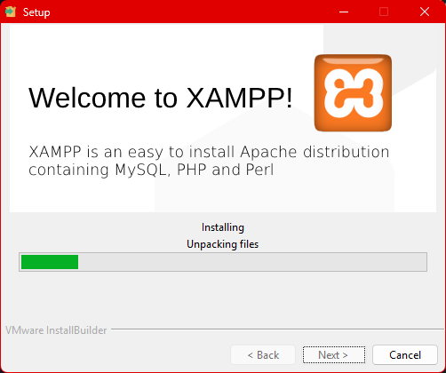
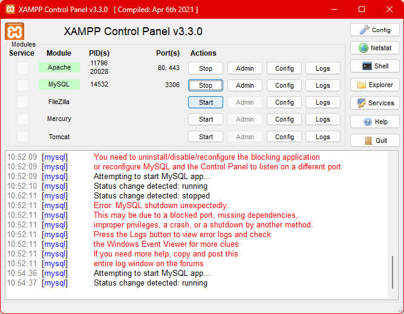
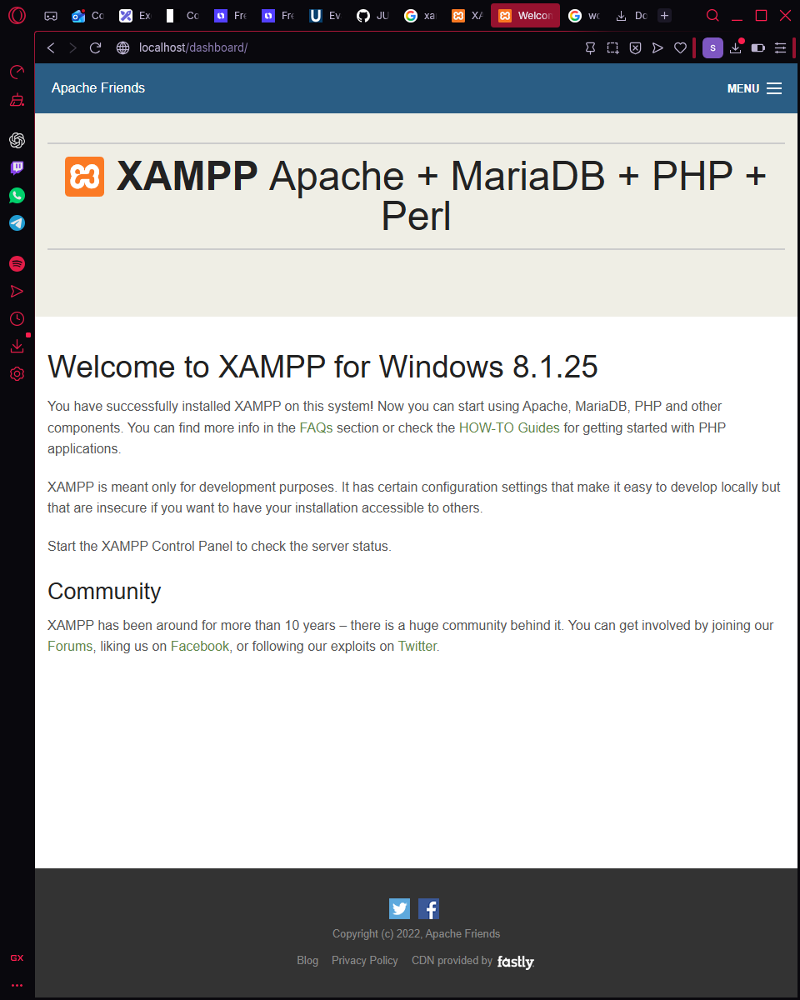
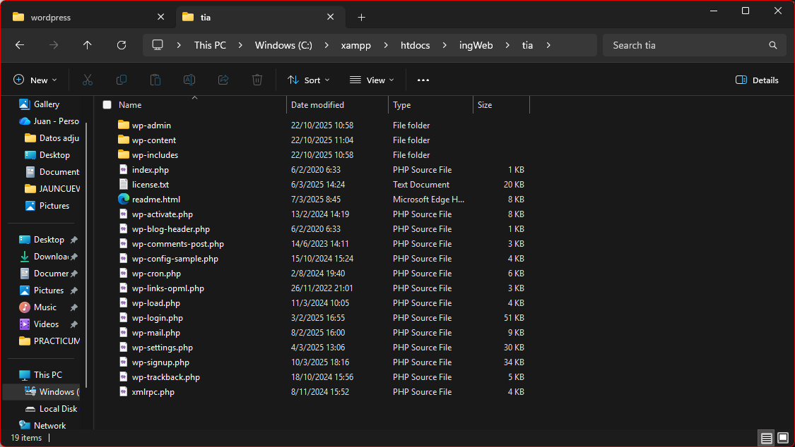
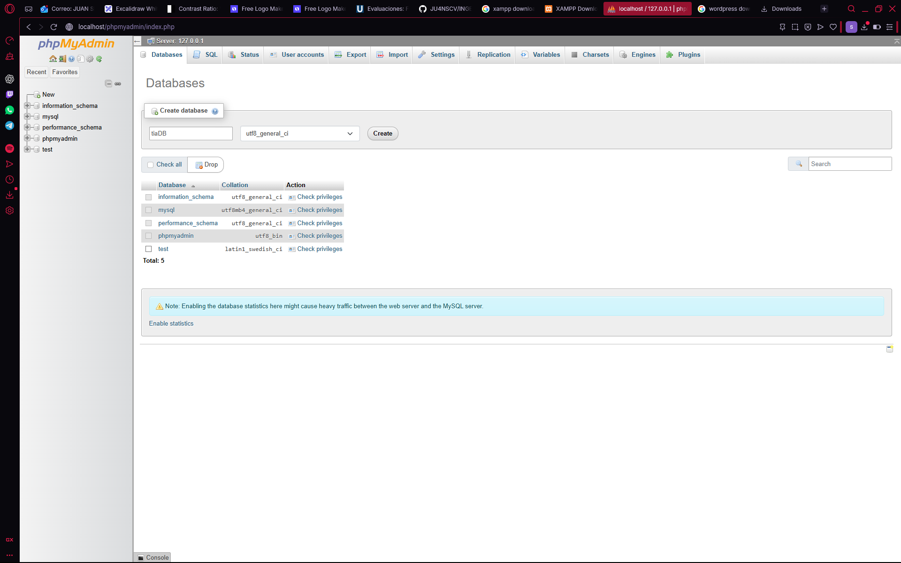
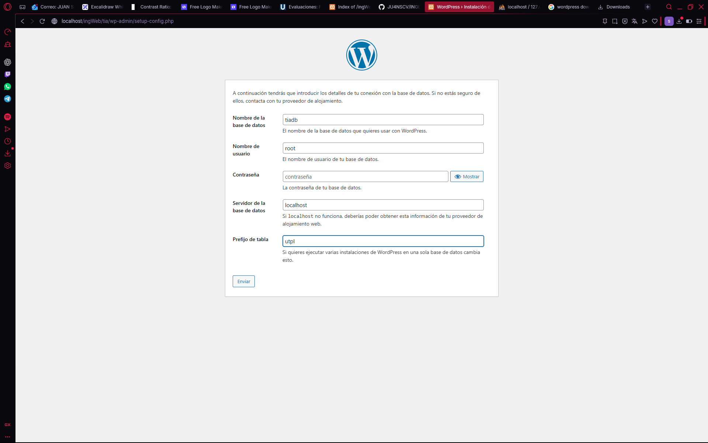
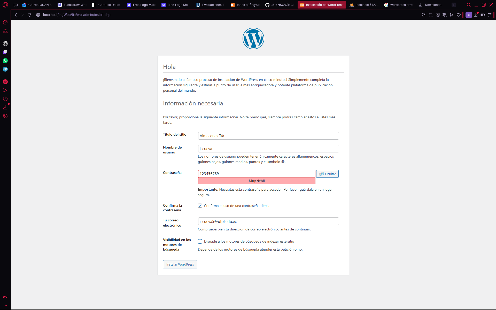
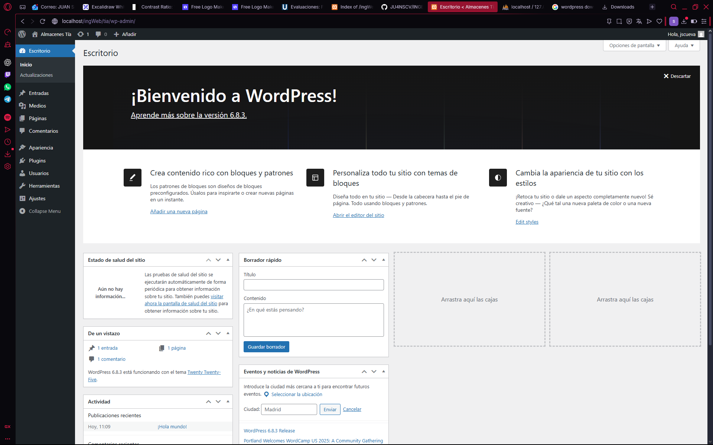
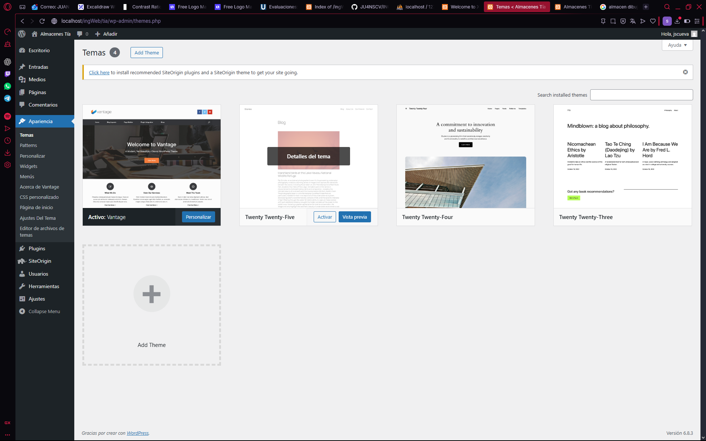
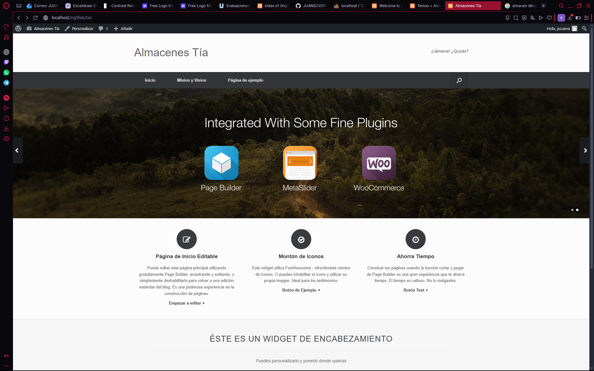

# Descarga de XAMMP for windows
    Primero descargamos un servidor para poder montar nuestro CMS, en este caso utilizaremos "[[XAMPP](https://www.apachefriends.org/es/download.html)]". Haremos uso de la tecnologia "PHP"

    **Nota:** Un CMS (Content Management System o Sistema de Gestión de Contenidos) es una plataforma que permite crear, editar y administrar sitios web sin necesidad de conocimientos avanzados de programación.

    
    
    Teniendo instalado el XAMPP tendremos que levantar lo siguiente,"MySQL Database" "Apache Web Server":
    
    
    
    Esperamos mientras se active

    Dentro del navegador colocaremos la siguiente direccion, "http://localhost/dashboard" o "127.0.0.1/ingWEB", para corroborar el funcionamiento. En este caso "ingWeb" es mi carpeta creada.

    

# Instalación de WordPress
    A su vez se descargo "[[WordPress](https://es-ec.wordpress.org/download)]" un sistema de gestion de contenidos (CSM) de codigo abierto que permite crear y administrar sitios web de forma sencilla.
    Teniendo todo descomprimido lo copiamos a la carpeta creada anteriormente "ingWeb"

    

# Creacion de la base de datos
    Dentro de la siguiente URL "http://localhost/phpmyadmin/index.php?route=/server/databases&lang=en", o dentro del apartado phpMyAdmin.
    A continuacion nos dirigimos a "Databases" y le pones de nombre "tiadb"

    

    Y creamos la base de datos

# Configuracion del WordPrees
    Teniendo el servidor levantado y la base de datos creada, vamos a la siguiente direccion para comenzar con la instalación 

    

    Dentro de los apartados rellenamos con nuestros datos y con el nombre de la base de datos que hemos creado previamente

    

    Le damos a "enviar" y nos redirige a un nuevo formulario, lo rellenamos con los datos solicitados y le damos a "instalar"

    

    Teniendo todo listo nos lanzara la paguina de inicio de WordPrees donde podremos editar, descargar themas o templates para empezar a generar nuestra propia paguina web

# Conocimiento de la interfaz de WordPrees

    

    Dentro del apartado de themas podemos seleccionar los themas con los cuales deseamos trabajar, para este ejercicio hemos utilizado "Vantage". Lo descargamos y lo activamos para que nuestra paguina cambie de apariencia.

    
    
    Si nos dirigimos a nuestra paguina "http://localhost/ingWeb/tia/" podemos precenciar los cambios realizados con el mero uso de un tema.

[[WordPress](https://es-ec.wordpress.org/download)]"

    